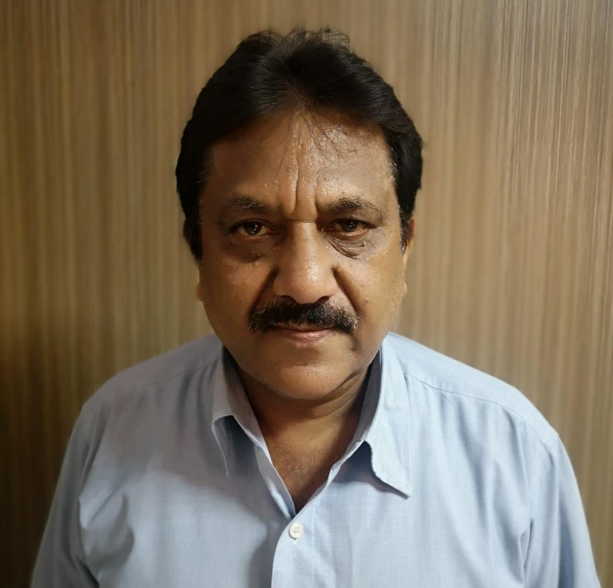

# Department of Applied Science  

## Message from HoD's Desk: Prof.(Dr.) D.S. Pathania

## Department at a Glimpse

 - This department was established in the year 1957, whose role is to deliver excellent quality education in the field of Applied Sciences for the future technocrats of all engineering streams. The department also endeavours to inculcate the scientific temper and the spirit of inquest in students. It inspires the students to realize and therefore apply the physical laws to the growth and development of their fields of study. We intensely think that an educational programme should be able to stimulate the development of a balanced and harmonious personality of the students. Hence, the educational program of GNDEC has been customised -to suit such necessities.

### AIM
- The Department of Applied Science & Humanities
The Department of Applied Sciences targets to provide a robust foundation in the basic science subjects of Engineering Mathematics, Physics, Chemistry and Professional English. We emerge as an International level Institute in producing and propagating knowledge, and providing students an exceptional learning experience in the discipline of science and technology that will best serve the world and advancement of mankind.
### MISSION
- The task of the Applied Sciences Department is to succeed, sustain and foster unsurpassed excellence in technical education. We chase continuous progress of infrastructure and boost state-of-the art capacities to offer our students a technologically up-to-date and knowledgeably stimulating environment of learning and guarantee high quality content by qualified faculty members who establishes the marks of excellence in their every endeavour.
### VISION
- Applied Sciences Department envisages as an academic staff developer for the Technical Education. We impart high levels of discipline in students and endeavour to set international standards, preparing our students technologically superior, who as a result shall contribute to the progression of society and mankind.

### FACILITIES & LABORATORIES
- Infrastructure

Nearly every topic taught during lectures has a related laboratory experiment. All Laboratories are completely equipped to conduct the practical and experiments as per the syllabus of the I.K. Gujral Punjab Technical University. The department pays huge attention to its laboratories & equipment and obtains modern equipments whenever essential. The labs provide abundant practical experience and facilitate the students with applications of their theoretical learning.

## Faculty Achievements  

### Mathematics ###
- **Dr. D.S. Pathania**
1. Chairman BOS Mathematics, College IKGPTU, Jalandhar
2. Chairman BOS(Applied Science)
3. Member of Academic Council, GNDEC, Ludhiana
4. Published 15 research papers in scopus and UGC approved journals
5. Attended 8 Short Term Courses
6. Guided one candidate leading to Ph.D course
7. Authored a book chapter entitled"*Interactions due to inclined loads in a microstretch thermoelestic medium with mass diffusion*", published by an International Publishing House, UK.
- **Pragya Goyal**
1. Webinar on  “ *Importance of Management Principles*” Conducted by the ECE  Department, KCG College of Technology, Chennai .
2. Short term online course on " *Nanotechnology for electronic and photonic devices*" of duration one week conducted by PEC, Chandigarh.
3. TEQIP III sponsored webinar on "*Women Safety, Rights and Gender Equality*” conducted by GNDEC,Ludhiana.
4. Two Weeks AICTE sponsored FDP on "*Innovative Pedagogical Methodologies and tools for effective learning in Engineering Education*" Conducted by MBA department , GNDEC,Ldh
5. TEQIP III sponsored FDP on *"ICT initiatives in Technical Education"* organised by Swayam-NPTEL Local Chapter, GNDEC, Ludhiana.
- **Sukhminder Singh**
1. Topped in Engineering Mathematics course conducted by NPTEL, 12 week course, September-December 2020, with a consolidated score of 90% and received Elite+Gold certificate.
2. Successfully completed Laplace Transform course conducted by NPTEL (4 weeks course), September-October 2020, with a consolidated score of 75% and received Elite+ Silver certificate.

-**Rajbir Kaur**

 
1. NPTEL online certificate course on Basic Linear Algebra, organised by IIT Bombay, February 2020-April 2020.
2. NPTEL online certificate course on Engineering Mathematics-I, organised by IIT Kharagpur, July 2020-December 2020.
3.  NPTEL online certificate course on Laplace Transform, organised by Institute of Mathematical Sciences, Chennai, July 2020- December 2020.

### Physics###
- **Dr. Randhir Singh**

 
1. Attended "*Recent trends in image processing techniques*", organised by Dept of IT GNDEC Ludhiana, 30 Dec 2019 to 20 Jan 2020.
2. Attended Professional development training programme conducted by IIM Raipur, 28 Jan 2020 to 1 Feb 2020.

- **Kuldeep Kaur**
1. One day TEQIP III sponsored webinar on “Women safety, rights and gender equality” organized by Guru Nanak Dev Engineering College, Ludhiana on 9th July, 2020
2. One day Workshop on “E-Learning” under SWAYAM-NPTEL Local Chapter organized by Guru Nanak Dev Engineering College, Ludhiana on January 24 (2020).
3. Attended  TEQIP III sponsored MOOC’S AWARENESS Workshop for faculty, organized by SWAYAM-NPTEL Local Chapter organized by Guru Nanak Dev Engineering College, Ludhiana on July 25 (2019)
4. One week AICTE sponsored workshop on Universal Human Values, AICTE IKGPTU Kapurthala Main Campus, Kapurthala, July 4-10 (2019)

- **Dr. Nandini Sharma** (*NEW RECRUITMENT IN PHYSICS*)

 Dr.Nandini Sharma completed her doctoral degree from University of Delhi in the field of solar energy materials in 2018.  Various keynote talks and presentations have been delivered by her in the Oxford University and the Surrey University situated in United Kingdom and has received travel award from NSIT, Delhi for the same. Moreover, she has been awarded in International conferences for best research work and oral presentations. Presently, she is acting as a reviewer of several international SCI journals. Being the reviewer of international SCI journals, possess more than 4 years of UG course teaching experience at the University of Delhi. Furthermore, 10 research papers in reputed international journals have been authored by her. Along with this, she is an international member of IRC Scientific and Technical Committee & Editorial Review Board on Physical and Mathematical Sciences.
1. Authored a book entitled “Principles of Nanotechnology: Analysis, Applications and Future Challenges”, published by LAP Lambert Academic Publishing, German publishing house, June 26, 2020, ISBN: 978-6202527620
2. Recognised as a reviewer of Chemical Physics journal of Elsevier, since January 2021.
3. Delivered an Invited Talk on topic “Characterization techniques for Studying properties of Nanomaterials”at International webinar on New Research Trends in Functional Physics, July1-4, 2020.
4. Delivered a session on “Emerging Teaching methods” to teachers in TEQIP III sponsored FDP on “ICT Initiatives in Technical Education” from 8-13 February, 2021 organized by SWAYAM-NPTEL Local Chapter, Guru Nanak Dev Engineering College, Ludhiana.
5. Participated in One day Workshop on “E-Learning” under SWAYAM-NPTEL Local Chapter organized by Guru Nanak Dev Engineering College, Ludhiana.
6. Awarded with the professional level certification in javascript programming language for designing applications and games, December 2020, by Whitehat Junior Private Limited.

### Chemistry###

- **Dr. Rajvir Kaur**
1. Published a research article, Rajvir Kaur and Harpreet Kaur, “Electrochemical Oxidation of Amido black 10B under Amperostatic conditions with vertically Oriented Graphite/Platinum Electrodes” Springer Publication Proceedings, Lecture Notes in Civil Engineering Sustainable Development through Engineering Innovations September17-19, 2020.
2. Delivered the Lectures at Atal Bihari Vajpayee Govt. Institute of Engineering & Technology, Pragtinagar, Shimla (H.P) from 17-21st February, 2020.
3. Successfully completed the two Coursera and one MOOC’s course.
4. Worked as Executive member in TEQIP III sponsored FDP on “ICT Initiatives in Technical Education” from 8-13 February, 2021 organized by SWAYAM-NPTEL Local Chapter, Guru Nanak Dev Engineering College, Ludhiana.
5. Worked as Executive member in TEQIP III sponsored One day workshop on “E-Learning” on 24th January, 2020 organized by SWAYAM-NPTEL Local Chapter, Guru Nanak Dev Engineering College, Ludhiana.
6. 20 hours self -paced TEQIP III sponsored course on “Efficient, Trackable and sustainable Workflow” organized by Examination branch with association of Department of Civil Engineering & Computer Science and Engineering at Guru Nanak Dev Engineering College, Ludhiana from 30-12-2020 to 05-01-2021.
7. Three days TEQIP III sponsored STC on “Smart Functional Materials for Emerging Applications” organized by Department of Applied Sciences, Punjab Engineering College (Deemed to be University) Chandigarh from 19st – 21st August, 2020.
8. Three days TEQIP III sponsored National workshop on “Transforming Pedagogy in India” organized by NIT, Jamshedpur from 1st – 3rd August, 2020.
9. One day webinar on “SWAYAM Awareness Workshop” organized by by I.K. Gujral Punjab Technical University Jalandhar on 9th July, 2020.
10. One day TEQIP III sponsored webinar on “Women safety, rights and gender equality” organized by Guru Nanak Dev Engineering College, Ludhiana on 9th July, 2020
11. One week webinar Lecture Series under IEEE organized by Guru Nanak Dev Engineering College, Ludhiana from 08-06-2020 to 13-06-2020.
12. One day TEQIP III sponsored webinar on “Modes of learning in Lockdown” organized by SWAYAM-NPTEL Local Chapter, Guru Nanak Dev Engineering College, Ludhiana on 11th May, 2020.
13. One day webinar on “NAAC Awareness Program for Autonomous Colleges” organized by NAAC Bangalore, India on 5th May, 2020.
14. One week FDP on “Nanomaterials and Devices” organized by Department of Applied Science, NITTTR, Chandigarh held from 27-04-2020 to 01-05-2020.
15. One day Workshop on “E-Learning” under SWAYAM-NPTEL Local Chapter organized by Guru Nanak Dev Engineering College, Ludhiana on January 24 (2020).

- **Karan Bhalla**
1. Completed Course work of PhD and obtained 9.80 SGPA with first RANK in University.
2. Qualified 4 Weeks NPTEL Course “Basics in Inorganic Chemistry” with 1 Credit along with Elite and Silver through SWAYAM Platform from IIT Bombay.
3. Qualified 12 Weeks NPTEL Course “Reagents in Organic Synthesis” with 3 Credits along with Elite and equivalent to 1.5 FDP through SWAYAM Platform from IIT Guwahati
4. Obtained 13 Software training certification from Spoken Tutorials IIT, BOMBAY of softwares like Latex, Moodle, Scilab, R software, Open Foam, Python 3.4.3 and PHP-MySQL after successful completion of course.
5. Attended 9 Faculty Development Program from NITTTR, Chandigarh, 9 FDP from NIT’s, 4 ATAL Programme, 5 STC, 11 STTP and 79 FDP in various interdisciplinary fields.
6. Attended 42 Workshops, 277 Webinars, 18 Conferences, 18 Symposium and 20 Seminars.
7. Attended 5 Skill Development/Orientation and Capacity Building Program.
8. Attended 8 Panel Discussion/Conclave on National Education Policy.
9. Delivered Extension lecture for Remedial Classes (UGC funded) as resource person in Govt. Ranbir College, Sangrur and received Certificate of Appreciation.
10. Received Certificate of Appreciation from Institute of Science & Technology for Advanced Studies and Research (ISTAR).
11. Received Certification of Appreciation on occasion of World Environment Day on 5th June 2020 from Indira Gandhi National Open University (IGNOU).
12. Received Certificate of Appreciation on occasion of Teachers Day Celebration on 5th September 2020 from SRM Institute of Science and Technology, Chennai and National Youth Council of India.
13. Received Certificate of Merit and Gold Medal from Gyansampada-A Knowledge Quest 2020 from Hulahul Foundation, Mumbai.
14. Received 2 Certificate of Appreciation from Regional Coordinating Institute (RCI), Odisha in association with Unnat Bharat Abhiyan.
15. Received Certificate of Merit from NIT Rourkela in association with Unnat Bharat Abhiyan, RCI Odisha and Genesys.

- **Mandeep Kaur**
1. Published 3 research articles in reputed SCI and Scopus indexed international journals.
2. Attended FDP ON “ ICT INITIATIVE IN TECHNICAL EDUCATION” , organised by GNDEC, Ludhiana.

- **Amanpreet Kaur Sodhi**
1. Published 2 research articles in reputed international SCI indexed journals.
2. Expert Lecture was delivered at ABVIET, Pragatinagar, Shimla  on 31st Oct 2019
3. Participated in Energy Conservation and Management (FDP),One Week (May 4 - 8, 2020 ), GNDEC Ludhiana.
4. Chemistry as a profession: Career Prospective (Webinar), One Day 29 May 2020, Rayat-Bahra Group.
5. Attended Methodology and data Interpretation of analytical Instrumentation Technique (FDP), One Week ( 15 June - 19 June 2020), Satyabhama Institute of Sc. and Tech. Tamil Nadu, India
6. 3rd  International Conf. on Innovative Technologies for Clean and Sustainable Development - 2 Sessions chaired on Feb19 and Feb 20, 2020 respectively, NITTTR Chandigarh
7. Research paper was presented  in 3rd International Conf. on Innovative Technologies for Clean and Sustainable Development, 19-21 Feb 2020, NITTR, Chandigarh
8. Smart Materials and Nanotechnology (FDP), One Week ( 02-06 Dec 2019 ), Patiala University, Punjab
9. Research Paper was presented and accepted for publication in SDIE-2020, held in GNDEC Ludhiana, October 2020, GNDEC, Ludhiana.
10. Member of NAAC Team for Criteria 3.
11.	Reviewer of Research Papers for SDIE-2020, held in GNDEC Ludhiana
12.	Conduct Official at SDIE-2020, held in GNDEC Ludhiana.
13.	External Examiner for VIVA Exam held at PCTE on 18 Dec 2019 and GGI Khanna on 18th  June 2020.
14.	Committee member for Study Scheme Mapping.
15.	Reviewer of Research Papers for International Journal of Precision Technology.
16.	Member of Student Greivance Redressal Committe, Research and development Cell and Equal opportunity Cell.
17.	In charge Internal Complaint/ Sexual Harassment  Committee.
18.	In charge Announcement Committee for Sports Day.

### ENGLISH###
- **Puneet Narang**
1. Webinar on Women Safety Rights and Gender Equality, organised by GNDEC, TEQIP-III, July 9,2020.
2. Attended National seminar on COVID-19 Mental Health, Solutions and Strategies, organised by Hindu College, Kapurthala,July 18, 2020.
3. Two week online FDP on ICT tools for teaching, learning process and institute, organised by NIT, Patna, August 10- August 21, 2020.
4. National level online Symposium on Pandemics: A Literary and Humanistic Appraisal, organised by Department of English,DAV College Abohar, August 22, 2020.
5. Delivered expert lecture on "Empathetic communication vis-a-vis adoption of Learner Centred Approach", in AICTE sponsored FDP on "Innovative Pedagogical Methodologies and Tools for Effective learning in Engineering Education", organised by Department of Business Administration, GNDEC, Ludhiana.

- **Amandeep Singh Bal**

  Topped in effective writing course conducted by NPTEL and scored 83% with ELITE+SILVER certificate, January-February 2020.
