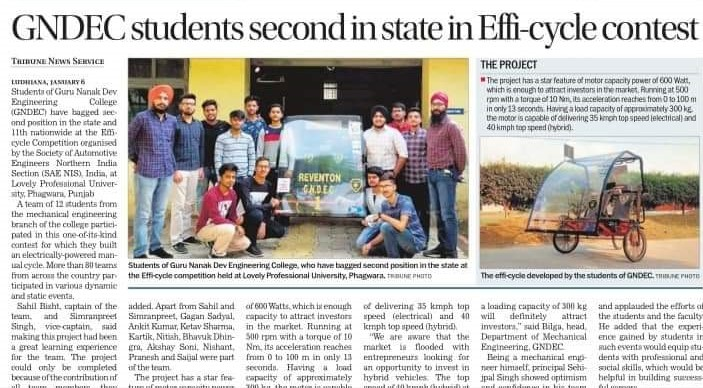
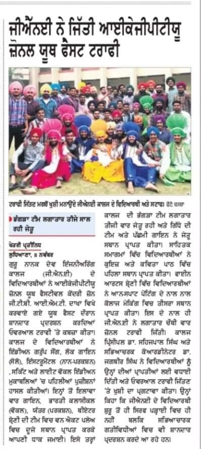
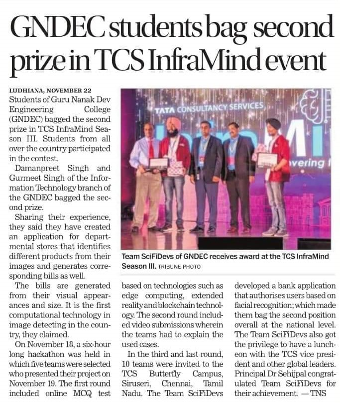
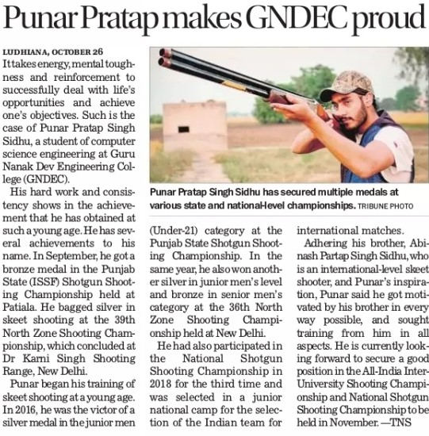
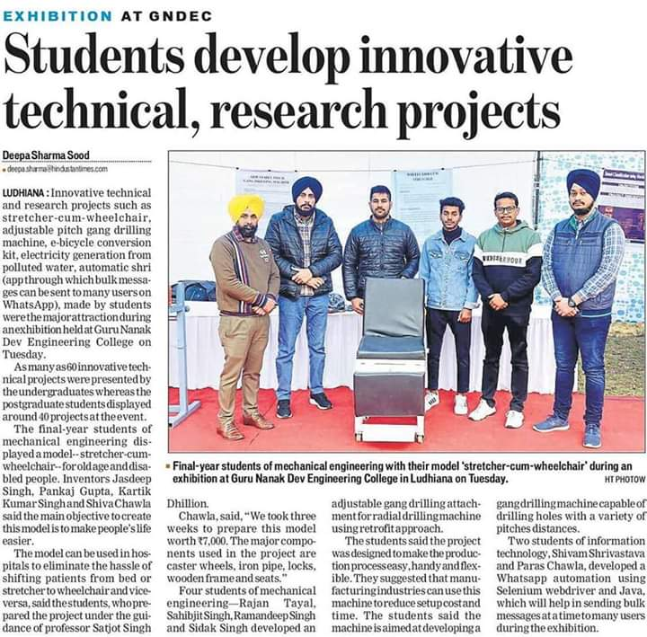
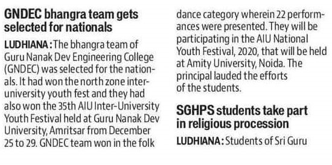
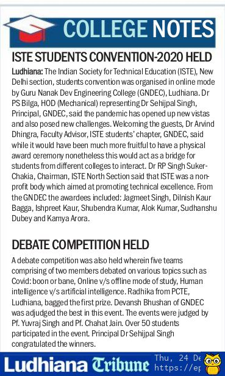
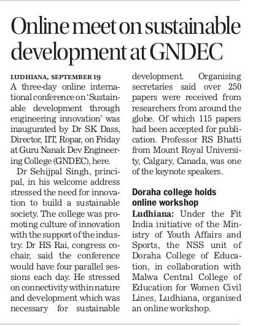
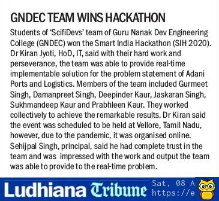
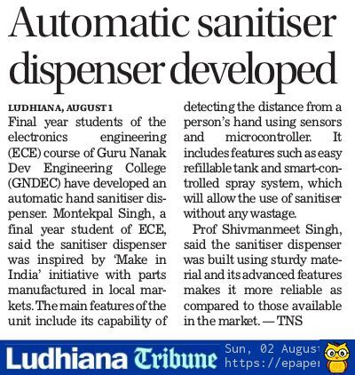

# **GNDEC in News**

## GNDEC students second in state in Effi-cycle contest

Students of Guru Nanak Dev Engineering College (GNDEC) have bagged second position in the state and 11th nationwide at the Effi-cycle Competition organised by the Society of Automotive Engineers Northern India Section (SAE NIS), India, at Lovely Professional University, Phagwara, Punjab
A team of 12 students from the mechanical engineering branch of the college participated in this one-of-its-kind contest for which they built an electrically-powered manual cycle. More than 80 teams from across the country participated in various dynamic and static events.

Sahil Bisht, captain of the team, and Simranpreet Singh, vice-captain, said making this project had been a great learning experience for the team. The project could only be completed because of the contribution of all team members, they added. Apart from Sahil and Simranpreet, Gagan Sadyal, Ankit Kumar, Ketav Sharma, Kartik, Nitish, Bhavuk Dhingra, Akshay Soni, Nishant, Pranesh and Saijal were part of the team.
The project has a star feature of motor capacity power of 600 Watts, which is enough capacity to attract investors in the market. Running at 500 rpm with a torque of 10 Nm, its acceleration reaches from 0 to 100 m in only 13 seconds. Having a load capacity of approximately 300 kg, the motor is capable of delivering 35 kmph top speed (electrical) and 40 kmph top speed (hybrid).
“We are aware that the market is flooded with entrepreneurs looking for an opportunity to invest in hybrid vehicles. The top speed of 40 kmph (hybrid) at a loading capacity of 300 kg will definitely attract investors,” said Bilga, head, Department of Mechanical Engineering, GNDEC.
Being a mechanical engineer himself, principal Sehijpal Singh showed optimism and confidence in his team and applauded the efforts of the students and the faculty. He added that the experience gained by students in such events would equip students with professional and social skills, which would be helpful in building successful careers.
The project
The project has a star feature of motor capacity power of 600 Watt, which is enough to attract investors in the market. Running at 500 rpm with a torque of 10 Nm, its acceleration reaches from 0 to 100 m in only 13 seconds. Having a load capacity of approximately 300 kg, the motor is capable of delivering 35 kmph top speed (electrical) and 40 kmph top speed (hybrid).

--------------------------------------------------------
## Mulit-talented students of GNDEC shines at IKGPTU Zonal Youth fest
#### GNDEC wins overall trophy at IKGPTU Zonal Youth fest

Leaving behind a trail of memories, the I. K. G Punjab Technical University Zonal Youth Festival central zone, reached its culmination at GTBIMT Dakha. Where participants from Guru Nanak Dev Engineering college , Ludhiana secured the following positions : Indian Group Song first , Light Vocal Indian- first , Vaar Singing- second , Folk Singing (Solo)- first , Indian Classical (Vocal)- second , Instrumental (Non-Percussion) - first , Instrumental (Percussion) – second. In theater category team secured second position in one act play and first position in skit ,whereas college bhangra team won the first position for the third time in a row and giddha team, Western singing secured winning position as well. In literary events students secured first position in quiz and poem recitation . In fine arts category students secured third position in the on-spot painting as well as collage making. Thus, GNDEC wins the overall zonal trophy for the fourth time in a row. Dr. Sehijpal Singh, Principal, GNDEC and Dr. Jabir Singh , Cultural Co-ordinator, congratulated the students for their achievements and expressed happiness and commented that, the students of GNDEC excelled not only in studies but in cultural activities as well.

--------------------------------------------------------

## GNDEC students bag second prize in TCS InfraMind event

Students of Guru Nanak Dev Engineering College (GNDEC) bagged the second prize in TCS InfraMind Season III. Students from all over the country participated in the contest.
Damanpreet Singh and Gurmeet Singh of the Information Technology branch of the GNDEC bagged the second prize.Sharing their experience, they said they have created an application for departmental stores that identifies different products from their images and generates corresponding bills as well.The bills are generated from their visual appearances and size. It is the first computational technology in image detecting in the country, they claimed.
On November 18, a six-hour long hackathon was held in which five teams were selected who presented their project on November 19. The first round included online MCQ test based on technologies such as edge computing, extended reality and blockchain technology. The second round included video submissions wherein the teams had to explain the used cases.
In the third and last round, 10 teams were invited to the TCS Butterfly Campus, Siruseri, Chennai, Tamil Nadu. The Team SciFiDevs developed a bank application that authorises users based on facial recognition; which made them bag the second position overall at the national level. The Team SciFiDevs also got the privilege to have a luncheon with the TCS vice president and other global leaders. Principal Dr Sehijpal Singh, congratulated Team SciFiDevs for their achievement.

--------------------------------------------------------
## Punar Pratap makes GNDEC proud

It takes energy, mental toughness and reinforcement to successfully deal with life’s opportunities and achieve one’s objectives. Such is the case of Punar Pratap Singh Sidhu, a student of computer science engineering at Guru Nanak Dev Engineering College (GNDEC).
His hard work and consistency shows in the achievement that he has obtained at such a young age. He has several achievements to his name. In September, he got a bronze medal in the Punjab State (ISSF) Shotgun Shooting Championship held at Patiala. He bagged silver in skeet shooting at the 39th North Zone Shooting Championship, which concluded at Dr Karni Singh Shooting Range, New Delhi.
Punar began his training of skeet shooting at a young age. In 2016, he was the victor of a silver medal in the junior men (Under-21) category at the Punjab State Shotgun Shooting Championship. In the same year, he also won another silver in junior men’s level and bronze in senior men’s category at the 36th North Zone Shooting Championship held at New Delhi.
He had also participated in the National Shotgun Shooting Championship in 2018 for the third time and was selected in a junior national camp for the selection of the Indian team for international matches. Adhering his brother, Abinash Partap Singh Sidhu, who is an international-level skeet shooter, and Punar’s inspiration, Punar said he got motivated by his brother in every way possible, and sought training from him in all aspects. He is currently looking forward to secure a good position in the All-India Inter-University Shooting Championship and National Shotgun Shooting Championship to be held in November.

--------------------------------------------------------
## Students develop innovative technical , research projects

A massive project exhibition displaying exhibits by various undergraduate and postgraduate students was held at Guru Nanak Dev Engineering College (GNDEC).The exhibition attracted a huge rush as novelty and innovation were the key feature depicted through the displays. It was major attraction for scientists, researchers and PhD scholars of various streams of engineering.
Around 70 innovative technical projects by BTech and 50 by MTech students were displayed in the exhibition.The chief guest for the day was Ranjhod Singh, managing director, GS Autos. Ranjodh belongs from the field of technical expertise. He said he was delighted to attend the exhibition and was impressed by the models.
Experts from various IITs, NITs and leading industries were called as judges for evaluating the quality of projects.
Principal Sehijpal Singh and faculty members appreciated the enthusiasm shown by students and congratulated them for their participation in the event. “The winners will be provided financial support from the college to get the innovative projects patented. The alumni of the 1963 batch will also provide financial grants for these projects,” said Parminder Singh, coordinator of the event.

-------------------------------------------------------
## Biggest panorama of the year for GNDEC Student: Hotel Mumbai

Setting another yardstick in the series of eminent events, Amandeep Singh, s/o Rajinder Singh, a student of Civil Engineering (2010- 2014 batch), plays a lead cast in the Hollywood movie; “Hotel Mumbai”.
Already declared a superhit, “Hotel Mumbai” is based on 26/11 attacks, which drew widespread global condemnation. Gaining an insight to the heinous act, the attack began on Wednesday 26 November and lasted until Saturday 29 November 2008. At least 174 people died, including 9 attackers, and more than 300 were wounded. Feeling fortunate to be a part of this movie, Amandeep Singh aka Imraan(in the movie) says that he has been really lucky in getting this opportunity in early stages of his life.
Amandeep Singh aka Imraan plays a terrorist in the film. It has been nearly 6 years of struggle for Amandeep in Mumbai & this seems to be the biggest break in his carrier of acting. He plays a Pakistani chap & mainly speaks Punjabi in the movie. This being a huge film in terms of cast & crew including Anupam Kher, Dev Patel, Armie Hammer and many other international stars and brand names, Amandeep aka Imraan plays a prime role in the movie.
Talking about his early life, Amandeep said he was always fascinated by the different amazing work actors do which triggered him to become an actor. He started his acting carrier in Punjabi music videos and short films. His GNE friends did a small production by making a short film, ‘Jimewar Kaun”; which still airs on you tube and that’s how the journey began. Feeling nostalgic about he mentions that these 4 years in GNE were the best days of his life and he misses his department, faculty & especially his friends. He mentions GNE is a pilgrimage form him and he adheres all his skills from here.
Further, He seeks Om Prakash Sir from National Scholl of Drama as his guru from where he is trained for acting. Om Prakash ji also has his own school in Mumbai as well, named “Clay School For Actors”. Feeling proud about the fact that GNE has a store house of talent, widespread in every field and walk of life, Principal, Dr. Sehijpal Singh wishes good luck to Amandeep and prays for the movie to be a great success.

-------------------------------------------------------
## GNDEC Bhangra team winner in north zone inter university youth fest

Guru Nanak Dev Engineering College Bhangra team stood winners in 35th AIU NORTH ZONE INTER- UNIVERSITY YOUTH FESTIVAL held at Guru Nanak Dev University, Amritsar from 25th to 29th of December, 2019
Belonging to the culture of Punjab, not forgetting the essence of the diverse ethnicity, GNDEC Bhangra team proved this authenticity by bagging the first position in inter zonal university youth festival.  More than 35 universities participated from north zone of the nation and GNDEC outshined by being an undefeatable winner. The category in which GNDEC won was folk dance category in which 22 diverse cultural dances were presented from various university teams.
Also, to add to the achievements, The Guru Nanak Dev Engineering College Bhangra team has been selected for nationals, for the second time, to participate in AIU NATIONAL YOUTH FESTIVAL, 2020 that is to be held at AMITY University, Noida.
Principal, Dr. Sehijpal Singh congratulated the cultural team; especially college Bhangra Team for bringing glory to the college and proving that for GNDEC students are all rounder’s plus sky is the limit for the Genconians.

------------------------------------------------------
## Akashdeep Singh, student of 2016(Civil Engineering Batch), GNDEC securing AIR 12 in UPSC conducted Engineering Services Exam (ESE) 2019

A series of achievements embark the saga of winning of GNDEC success stories as Akashdeep Singh, student of 2016(Civil Engineering Batch), GNDEC, contributes in it by securing AIR 12 in UPSC conducted Engineering Services Exam (ESE) 2019.
Akashdeep Singh, who is currently working as a Management Trainee (Civil) in Coal Limited, Bokaro, Jharkhand since Feburary 2018; couldn’t express his happiness in words and was overwhelmed with his result. Belonging to a small town of Malerkotla, Sangrur and a kin to Mr. Daljit Singh, retired second in command (2iC), CRPF, He had completed his schooling from various Kendriya Vidhyalyas. He also cracked the GATE examination in the year 2016 by scoring AIR 276, he got admission in IIT Bombay in Structural Engineering. Thanking God Almighty, his parents and his professors of GNDEC Civil Engineering under whose guidance he was able to acquire the learning and excellently skilled environment, he shows full enthusiasm for moving ahead with full zeal and fervour.
His hobbies include watching tennis and football. He idealises Roger Fedrer as a symbol of persistence and seer dedication.
Principal GNDEC, Dr. Sehijpal Singh and Dr. H.S Rai , H.O.D, civil engineering, congratulated Akashdeep Singh and his family for this wonderful success and floats this testimony as an encouragement for the students as a motivational factor to move ahead.
The promising future of the students lie on getting stimulated from the success stories and that is what GNDEC is compassionate about building.

-------------------------------------------------------

## ISTE Students Convention 2020 held at GNDEC'

Indian society for Technical Education (ISTE), New Delhi’s section students convention was organized in online mode by Guru Nanak Dev Engineering College, Ludhiana. The ISTE north section comprises of states of Punjab, Himachal Pradesh, Chandigarh, Jammu & Kashmir. Giving his opening remarks, Dr. P.S. Bilga, HOD (Mechanical) representing Dr. Sehijpal Singh, Principal, GNDEC said that COVID crisis has opened up new vistas and also posed new challenges. Welcoming the guests, Dr. Arvind Dhingra, Faculty Advisor- ISTE students’ chapter GNDEC said that while it would have been much more fruitful to have a physical award ceremony nonetheless this would act as a bridge for students from different colleges to interact. Dr. R.P.Singh Suker-Chakia, Chairman, ISTE North Section said that ISTE was a non- profit body which aimed at promoting technical excellence. 19 students from various institutions under the ISTE North section were honored with Best Student award for their performance in their chapters. The awardees shared their experiences in their respective chapters and also how during this pandemic they had conducted the various activities. From Guru Nanak Dev Engineering College, Ludhiana the awardees included: Jagmeet Singh, Dilnish Kaur Bagga, Ishpreet Kaur, Shubendra Kumar, Alok Kumar, Sudhanshu Dubey and Kamya Arora.
A debate competition was also held wherein five teams comprising of two members debated on various topics that included Covid: boon or bane, Online v/s offline mode of study, Human intelligence v/s artificial intelligence. Radhika from PCTE, Ludhiana bagged the first prize. This was followed by a group discussion session on the topic of COVID crisis. Devansh Bhushan of GNDEC was adjudged the best in this event. The events were judged by Pf. Yuvraj Singh and Pf. Chahat Jain.More than 50 students actively participated in this event. Principal GNDEC Dr. Sehijpal Singh congratulated the winners and the organizers for successful conduct of the event. Dr. Jagbir Singh, Treasurer, ISTE North section, Dr. Harmeet Singh, Professor, ME participated in the event.

-------------------------------------------------------
## International Conference on sustainable innovations started at GNDEC

A three day on line international conference on ‘Sustainable Development through Engineering Innovation was inaugurated by Dr S.K Dass, Director IIT Ropar today at Guru Nanak Dev Engineering College (GNDEC), Ludhiana. The conference aims at highlighting the innovative solutions to various engineering problems. Dr. Sehijpal Singh, Principal in his welcome address stressed the need for innovation to build a sustainable society. He said that college is promoting culture of innovation with support of industry. Giving further details of the conference, Dr H S Rai, Congress co- chair said that three day multi track conference shall have four parallel sessions each day. He stressed upon connectivity within nature and development which is necessary for sustainable development. The organizing secretaries informed that over 250 papers were received from researchers from around the globe. Out of which 115 papers have been accepted for publication. The papers have been published in lecture notes series of a well know publisher‘Springer’.
Professor R S Bhatti from Mount Royal University, Calgary, Canada, one of the keynote speakers said that the world is facing drastic climatic change and there was an urgent need to adopt new business to survive. He gave examples from real life of water saving by Scotland using sensors in water pipes leading to saving of 2 trillion gallons of water. Sh. S. C. Ralhan, Chairman , Board of governors, NIT, Jalandhar and leading industrialist who was the Guest of honor said that innovation was the need of the hour. Without innovation industry cannot survive. He suggested that the findings from conference be shared with industry for possible commercialization. Dr.Sarabjot Singh Anand, renowned data scientist, Ex Professor, University of Warwick, UK gave an insight into how data mining was helping in conserving energy and making world more sustainable. S. Mukhinder Singh one of the distinguished industrialists of Punjab & Managing Director, SECO said that innovation was the tool with technology as raw material . Er. Rahul Ahuja an alumnus of the college, a leading industrialist and vice chairman CII Punjab  while speaking on the occasion expressed fear that our current developments will not make us survive in next century. He said that now is the exciting phase and is challenging for people who wish sustainable development through innovation. For sustainable development, he cited 3Ps- Planet, People and profit as necessary pillars of sustainable development. He urged the students to develop innovative ideas from their daily experiences.
The chief guest for the occasion was Dr Sarit K Das, Director, IIT, Ropar. He said that there has been a series of innovation since industrial resolution 1.0. It was only in last 30 years that sustainable development was being talked about. He cited from scriptures that to create a better nation, create a better individual and better institutions. Young minds were more adapt to innovate then the older ones. He stressed upon making institution with innovative culture and research orientation. India had a glorious past in Nalanda like university hubs which were centres of excellence having 16 smaller universities around it all flourishing and producing innovations. He stressed upon creating difference of ambience and suggested that we should not run after numbers but rather concentrate on impact. He cited GNDEC as a friend institute and said that with due cooperation both the institutes could change the technical scenario of Punjab and North India.
Delivering the vote of thanks, Dr.Arvind Dhingra, organizing secretary thanked all researchers, reviewers, expert speakers and delegates for attending the inaugural ceremony.  He also thanked the sponsors TEQIP-III, The institution of Engineers, Ludhiana local Chapter, Consultancy cell GNDEC for their effort.

-------------------------------------------------------
## Glorious victory of GNDEC team in Smart India Hackathon 2020

 In yet another feather of achievement added to the cap of technical achievements, students of ScifiDevs team of Guru Nanak Dev Engineering College, Ludhiana won the World's Biggest National Level Hackathon, *Smart India Hackathon (SIH 2020). *
 Dr. Kiran Jyoti, HoD, IT said that with their hard work and perseverance, the team was able to provide real time implementable solution for the problem statement of *Adani Ports and Logistics. * with which they seemed very overwhelmed and applauded the efforts of team and college authorities. They will soon be implementing the solution by developing a Seamless Invoicing and Reconciliation System for the company to handle its business and payments as per the parameters and solution provided by the team.
The team members included Gurmeet Singh ( Team Leader), Damanpreet Singh, Deepinder Kaur, Jaskaran Singh, Sukhmandeep Kaur & Prabhleen Kaur and they worked collectively to achieve the remarkable results.The event was originally going to be held at Vellore, Tamilnadu but due to Coronavirus pandameic, it was organised online. the process of evaluation and every other sort of management has been done virtually from the nodal centre i.e. from Vellore Institute of Technology, Vellore, Tamilnadu. To add to the hurdles of students, the experts from MHRD Innovation cell and AICTE were involved directly from New Delhi, making the process tougher for judgement.
This being another year of victory for the team; the tremendous devotion they showed towards the project is worth appreciation. The ScifiDevs team seemed joyful after the victory and  thanked their mentors in the department and college for providing  tremendous amount of support and provision of all the facilities even in these pandemic times.
Dr. Sehijpal Singh, principal  mentioned that he had complete trust in the team and was really impressed with the work and output the ScifiDevs team was able to provide to the real time problem.

--------------------------------------------------------
## GNDEC students develop Smart Automatic Hand Sanitizer Dispenser

Innovation is a boom when utilized in an effective manner. With such vision in mind, final year Electronics Engineering students of Guru Nanak Dev Engineering College (GNDEC) came up with an ‘automatic hand sanitizer dispenser’; the much-needed call of the hour.
MONTEKPAL SINGH, final year ECE student disclosed that the automatic hand sanitizer dispenser is made using MAKE IN INDIA theme with parts manufactured from local markets. Main features include its capability of detecting the distance from the person’s hands with the use of sensors and microcontroller. It has features like easy refillable tank and smart controlled spray system which will allow the use of sanitizer efficiently without any wastage. Furthermore, the system is tested vigorously for any problems and reliability issues. Irrespective of day or night, the programmed sensor would detect the presence of hands from a particular distance conveniently.
Prof. Shivmanmeet Singh, under whose guidance the project was framed, mentioned that the features of the sanitizer dispenser could be enhanced in the form of automatic disinfecting chamber. He mentioned that the sanitizer dispenser was built using sturdy materials and its advanced features makes it more reliable as compared to the already available sanitizer dispensers in the market.
Professor Ameeta Seehra, HOD, ECE, feels proud by the efforts put in by the students. Principal Dr. Sehijpal Singh, commented that with a market flooded with such products, innovation from our students is sure to transform the trends by creating such low cost and useful products.

