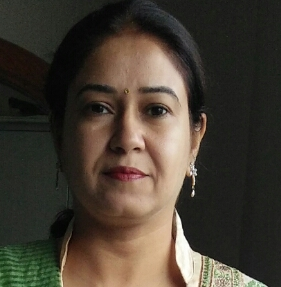
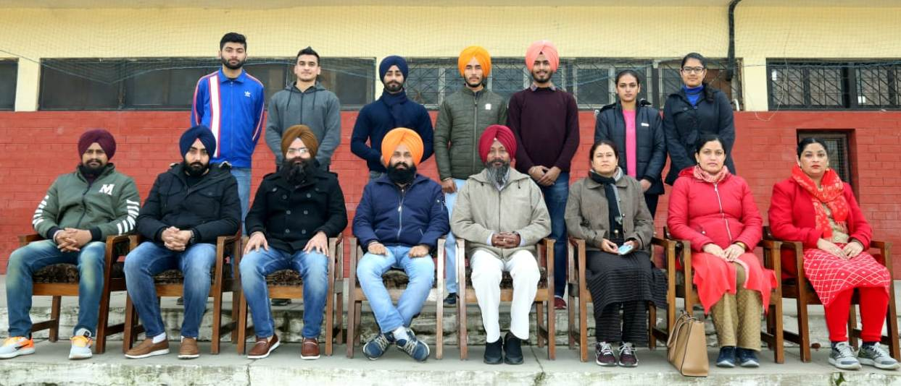

# Department of Physical Education & Sports

## Message from HoD's Desk

The Sports department works on promotion of personal and professional development of students through designing and implementing programs that support healthy lifestyles and inculcate moral,ethical and spiritual values among them through intramural and extramural activities.Thus,all students must actively take part in sports activities offered by the college within the campus."Stay Active Stay Fit"

## Sport's Committee

## Sport's Department at Glimpse

- [Infrastructure](Infra.md)
- [Intra-murals](Intra.md)
- [Extra-murals](Extra.md)

## Achievements  

- Er. Heena Malhotra completed her PhD in ...

## Publications  

- [**Yuvraj Singh**, **Harvinder Singh**. (2021) Applications of Fiber Reinforced Polymer Laminates in Strengthening of Structures.
In: Ashish D.K., de Brito J., Sharma S.K. (eds) 3rd International Conference on Innovative Technologies for Clean and Sustainable Development. ITCSD 2020.
RILEM Bookseries, vol 29. Springer, Cham. https://doi.org/10.1007/978-3-030-51485-3_17](https://link.springer.com/chapter/10.1007/978-3-030-51485-3_17)

- [**Yuvraj Singh**, Sukhwant Singh, **Harvinder Singh**. (2021) Effect of Steel Fibers on the Sorptivity of Concrete. In: Seetharamu S., Jagadish T., Malagi R.R. (eds)
Fatigue, Durability, and Fracture Mechanics. Lecture Notes in Mechanical Engineering. Springer, Singapore.
https://doi.org/10.1007/978-981-15-4779-9_32](https://link.springer.com/chapter/10.1007/978-981-15-4779-9_32)

- [Harpuneet Singh,**Yuvraj Singh** (2019) Applications of Recycled and Waste Materials in Infrastructure Projects. In: Singh H., Garg P., Kaur I. (eds)
Proceedings of the 1st International Conference on Sustainable Waste Management through Design. ICSWMD 2018. Lecture Notes in Civil Engineering,
vol 21. Springer, Cham. https://doi.org/10.1007/978-3-030-02707-0_65](https://link.springer.com/chapter/10.1007/978-3-030-02707-0_65)

## Events Organized (FDPs/Conferences/STCs/SDTs/Workshops/Webinars etc.)  

| Sr. No. | Name of Event                                             | Faculty Coordinator           | Duration | Date(s)               | Sponsor(s) |
|:--------|:---------------------------------------------------------------|:------------------------------|:---------|:----------------------|:-----------|
| 1       | SDT on "Efficient, Trackable and Sustainable Workflow" (Run-1) | Dr H S Rai & Er. Yuvraj Singh | One Week | 02-08 December, 2020  | TEQIP-III  |
| 2       | SDT on "Efficient, Trackable and Sustainable Workflow" (Run-2) | Dr H S Rai & Er. Yuvraj Singh | One Week | 30 Dec - 05 Jan, 2020 | TEQIP-III  |
|         |                                                                |                               |          |                       |            |

## Events Attended (FDPs/Conferences/STCs/SDTs/Workshops/Webinars etc.)  

| Sr. No. | Name of Faculty | Name of Event | Duration | Date(s) | Organizing Institute |
|:--------|:----------------|:--------------|:---------|:--------|:---------------------|
| 1       |                 |               |          |         |                      |
| 2       |                 |               |          |         |                      |
|         |                 |               |          |         |                      |

## Miscellaneous (Lab Upgradation, Infrastructure augmentation etc.)  

- (You can add any miscellaneous details related to your department here which you feel should be added in Newsletter)

## Student's Corner  

#### - Student's Achievements

## Association of Civil Engineering students (ACES)

- (Here you can add news/details of events conducted etc., related to your departmental Society). *DO NOT forget to replace the title with the name of your departmental Society*

**NOTE:** Feel free to add any other information in the form of paragraph, bulleted list, numbered list, etc. For any queries or help, post in Whatsapp group. **And do not forget to delete this note. ;-)**
