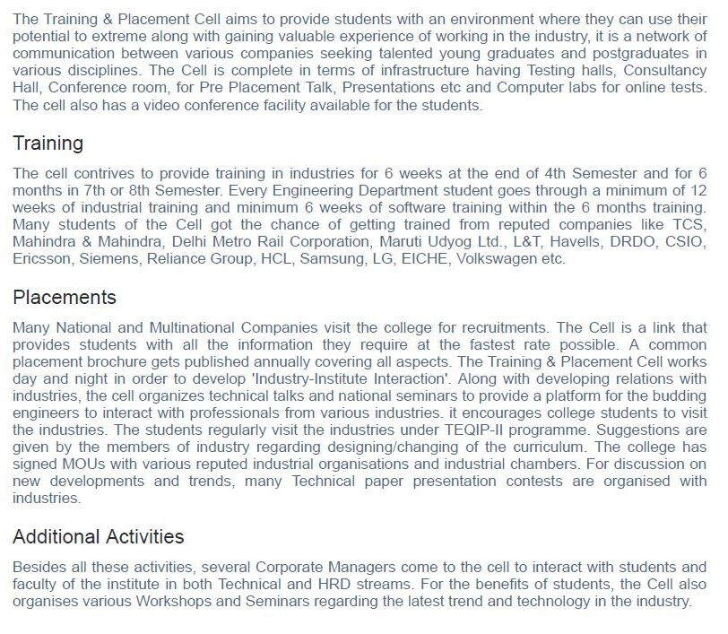

# Training And Placement Cell

## Message from TPO's Desk

I gladly bring a warm welcome to you on the behalf of Training & Placement Cell of Guru Nanak Dev Engineering College, Ludhiana.

Globally accepted as a source of academically and professionally excellent students, Guru Nanak Dev Engineering College, Ludhiana, is known for its professional approach, cultural activities and academic rigour. Our college showcases its rich heritage and knowledge through the hands of its highly-rated faculty all over Punjab and provides students with an opportunity to carve a new path in their life. It is a moment of great pride to state that Guru Nanak Dev Engineering College is being awarded as the “Best College for Placements” under PTU every year since 2013. Further achievement being, the accreditation of Autonomous College by UGC in the year 2012.

The Training and Placement Cell, GNDEC along with giving an outstanding placement record, also serves as a platform for students to gain a market exposure and groom their personalities as well. The prime focus is not to just create engineers rather leaders which may lay the foundation for the future development of our nation. The Training & Placement Cell is an interface that looks after the students and the recruiting organizations, taking care of the interests of both.
Students of the previous batches have further assured the solid foundation of our institution by taking placements in companies with top global reputation. The bonds developed with the industries ultimately lead to a great future ahead, providing an environment for research and education. Thus,  I invite the recruiting organizations and graduating students to find the best match between their needs and capabilities and look forward to have your active participation.

## Major Recruiters
\

\

## Training And Placement team
\

Guru Nanak Dev Engineering College also has an active training and placement cell in order to assist our students in identifying their ambitions and life goals in the trending competitive placement market. T&P provides the infrastructural facilities to conduct group discussions, tests and interviews besides catering to other logistics.

The Training & Placement Cell was applauded for its efforts and achievements by a national daily.

## HR Summit 2020 in Collaboration with CII
\

Today’s technology has paved the way for better communication and ensured fast and visible communication between the industries and job seekers.

To promote this proactive exchange, Guru Nanak Dev Engineering College in association with Confederation of Indian Industry organized an HR summit on “Bridging the gap between Industry and Academia” at Radisson Blu, MBD Neopolis Mall, Ludhiana, Punjab.

The prominent speakers from reputed companies like TCS, Accenture, Infosys, Ambuja Cement, Kangaroo, Amber, Nahar Group, Themax, Mahindra & Mahindra and many more marked their presence at the conference.

## Placement Highlights
\

## Student Achievements

## Events

