# Training And Placement Cell

The Training and Placement cell aims to provide students with an environment where they can use their potential to extreme along with gaining valuable experience of working in the industry, it is a network of communication between various companies seeking talented young graduates and post graduates in various disciplines. The cell is complete in terms of infrastructure having Testing halls, Consultancy Hall, Conference room for Pre Placement Talk, Presentations etc.  The cell also has video conference facility available for the students.

### Training

The cell contrives to provide training in industries for 6 weeks at the end of 4th semester and for 6 months in 7th or 8th semester. Every Engineering Department student goes through a minimum of 12 weeks of industrial training and minimum 6 weeks of software training within the 6 months training. Many students of the cell got the chance of getting trained from reputed companies like TCS, Mahindra & Mahindra, Delhi Metro Rail Corporation, Maruti Udyog Ltd, Havells, DRDO, CISCO, Ericsson, Siemens, Reliance Group, HCL, Samsung, LG, EICHE, Volkswagen etc.

### Placements

Many National and Multinational companies visit the college for recruitments. The Cell is a link that provides students with all the information they require at the fastest rate possible. A common placement brochure gets published annually covering all aspects. The Training & Placement Cell works day and night in order to develop 'Industry-Institute Interaction'. Along with Developing relations with the industries, the cell organizes technical talks and national seminars to provide a platform for budding engineers to interact with professionals from various industries, it encourages college students to visit the industries. The students regularly visit the industries under TEQIP-II programme.

----

## Message from TPO's Desk

I gladly bring a warm welcome to you on the behalf of Training & Placement Cell of Guru Nanak Dev Engineering College, Ludhiana.

Globally accepted as a source of academically and professionally excellent students, Guru Nanak Dev Engineering College, Ludhiana, is known for its professional approach, cultural activities and academic rigour. Our college showcases its rich heritage and knowledge through the hands of its highly-rated faculty all over Punjab and provides students with an opportunity to carve a new path in their life. It is a moment of great pride to state that Guru Nanak Dev Engineering College is being awarded as the “Best College for Placements” under PTU every year since 2013. Further achievement being, the accreditation of Autonomous College by UGC in the year 2012.

The Training and Placement Cell, GNDEC along with giving an outstanding placement record, also serves as a platform for students to gain a market exposure and groom their personalities as well. The prime focus is not to just create engineers rather leaders which may lay the foundation for the future development of our nation. The Training & Placement Cell is an interface that looks after the students and the recruiting organizations, taking care of the interests of both.
Students of the previous batches have further assured the solid foundation of our institution by taking placements in companies with top global reputation. The bonds developed with the industries ultimately lead to a great future ahead, providing an environment for research and education. Thus,  I invite the recruiting organizations and graduating students to find the best match between their needs and capabilities and look forward to have your active participation.

----

## Major Recruiters
\
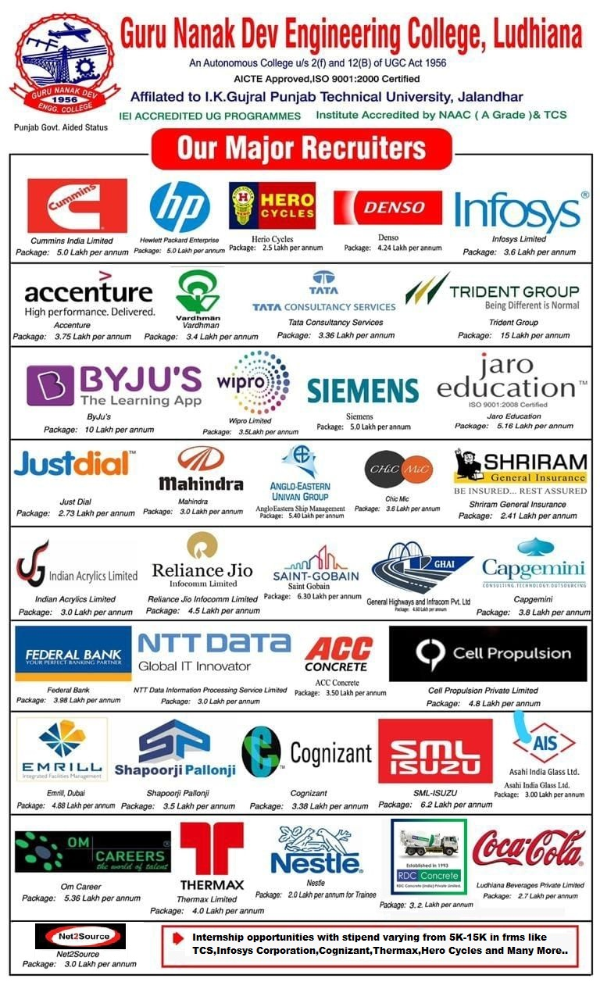

\
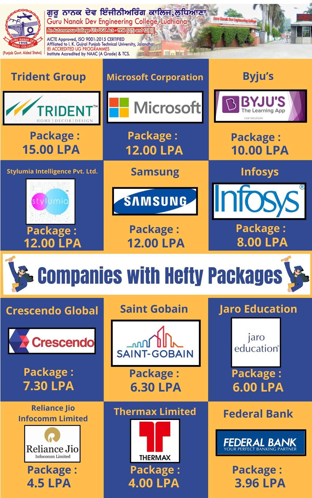

----

## Training And Placement team
\
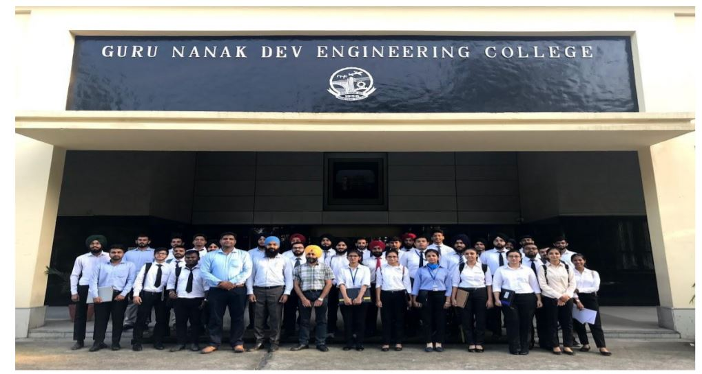

Guru Nanak Dev Engineering College also has an active training and placement cell in order to assist our students in identifying their ambitions and life goals in the trending competitive placement market. T&P provides the infrastructural facilities to conduct group discussions, tests and interviews besides catering to other logistics.

The Training & Placement Cell was applauded for its efforts and achievements by a national daily.

----

## HR Summit 2020 in Collaboration with CII
\
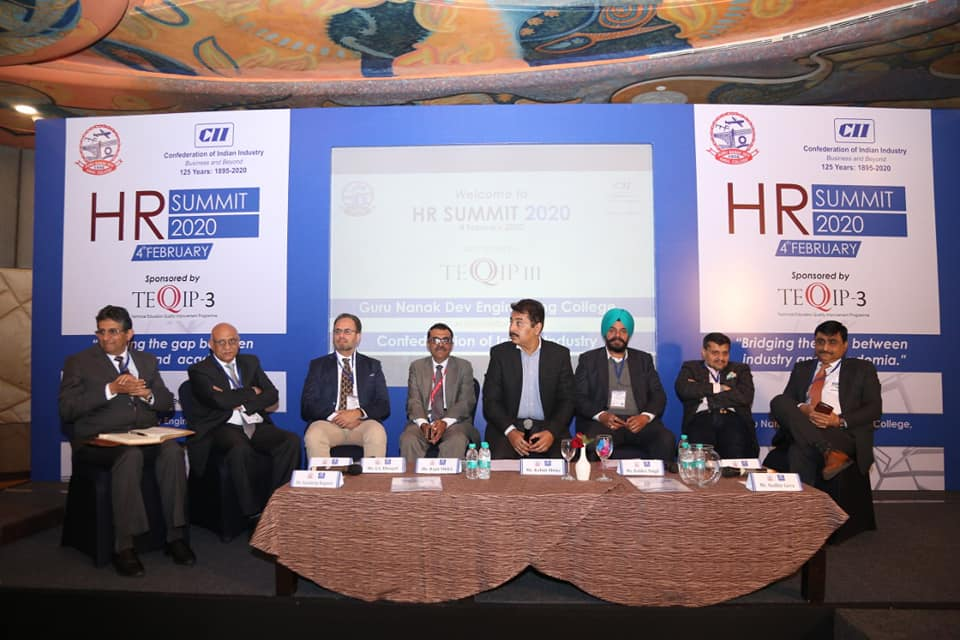

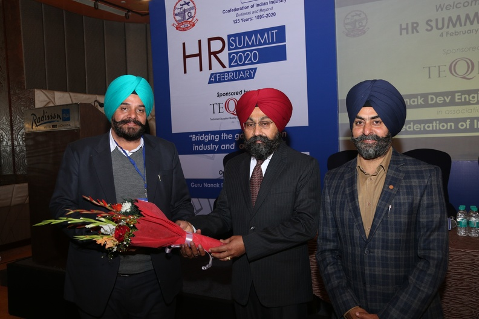

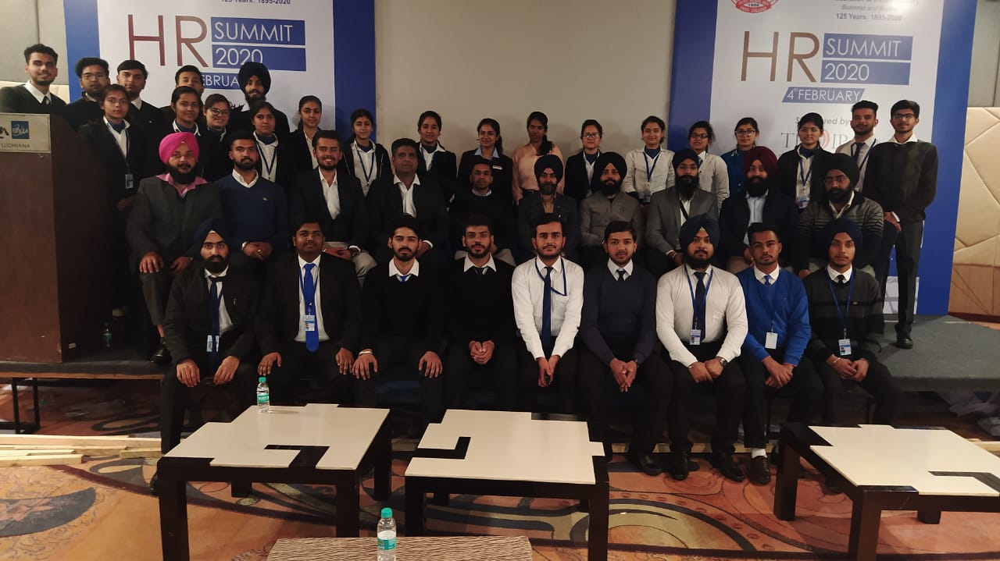

Today’s technology has paved the way for better communication and ensured fast and visible communication between the industries and job seekers.

To promote this proactive exchange, Guru Nanak Dev Engineering College in association with Confederation of Indian Industry organized an HR summit on “Bridging the gap between Industry and Academia” at Radisson Blu, MBD Neopolis Mall, Ludhiana, Punjab.

The prominent speakers from reputed companies like TCS, Accenture, Infosys, Ambuja Cement, Kangaroo, Amber, Nahar Group, Themax, Mahindra & Mahindra and many more marked their presence at the conference.

----

## Placement Highlights
\
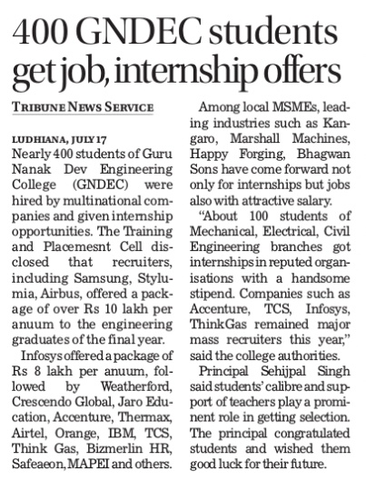

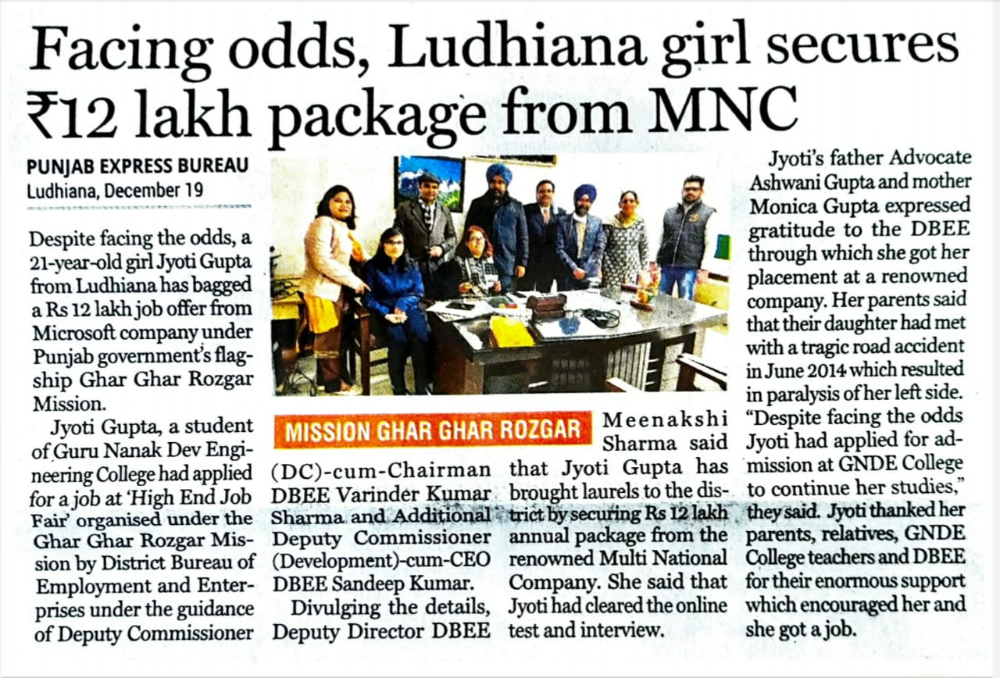

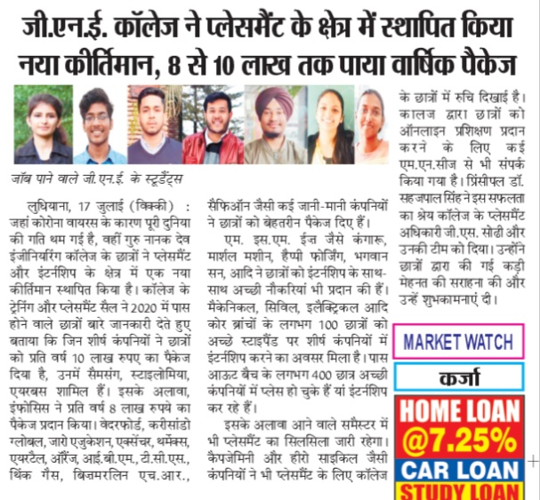

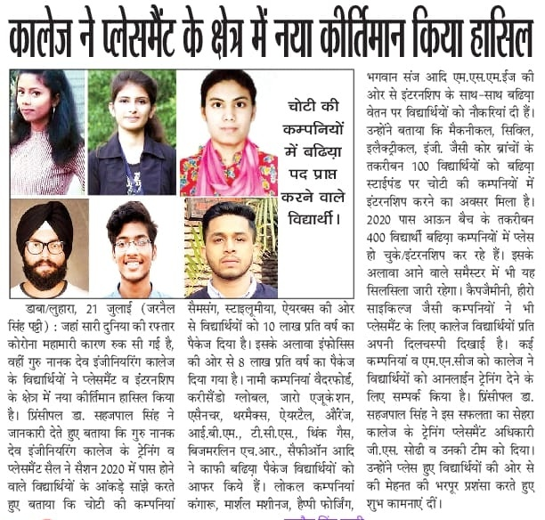

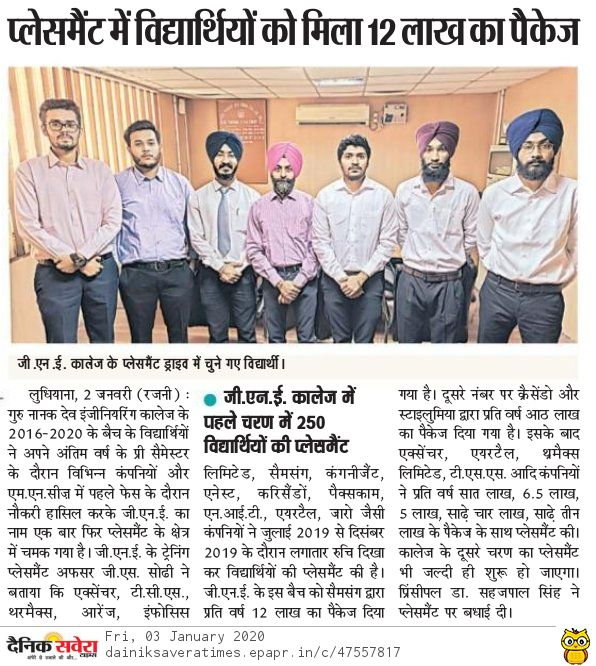

----

## Student Achievements

\
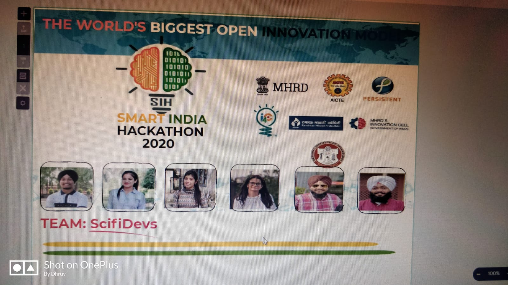

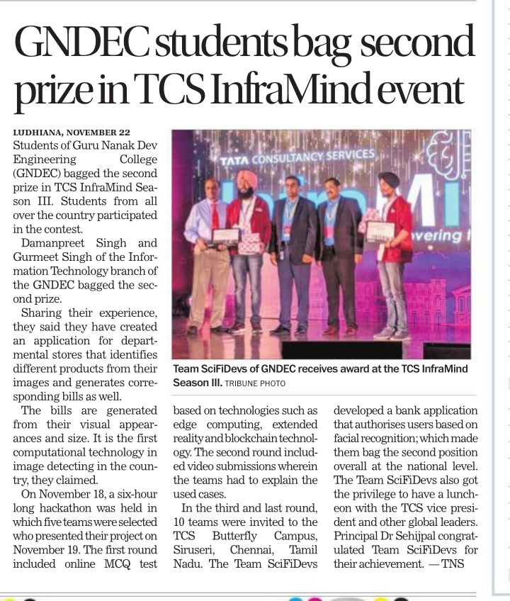

## Events
\

TCS CodeVita, is a contest for engineering and science students to experience the joy of coding and to sharpen their programming skills through real-life computing practices. The contest also aims at identifying the talent, besides providing the student community, an opportunity to earn peer recognition.

----

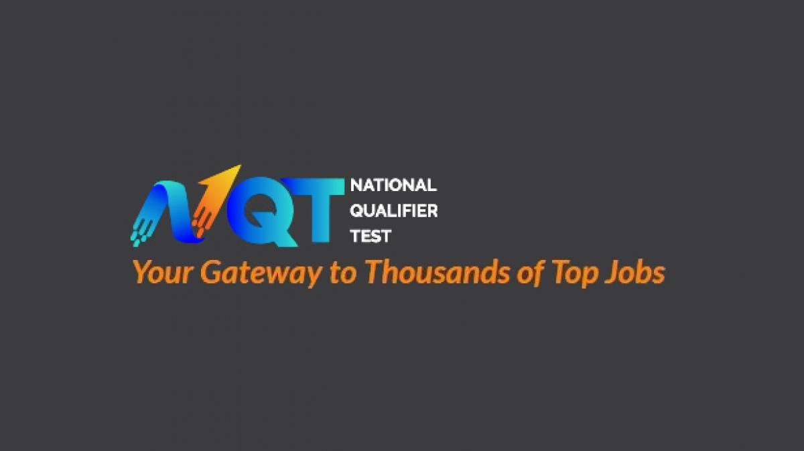

NQT - which is conducted by TCS' strategic unit TCS iON - is a multi-level assessment to assess competence on core cognitive abilities required for entry-level jobs, industry-specific knowledge and insights, and specialisation on skills required for performing the job role.

----

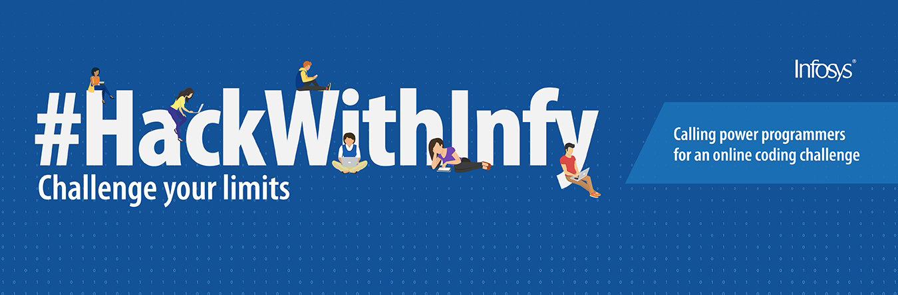

HackWithInfy is India-wide coding competition for final year engineering students. ... Top performers in the competition not only win exciting prizes, but also earn a chance to work with Infosys in niche technical roles.

----

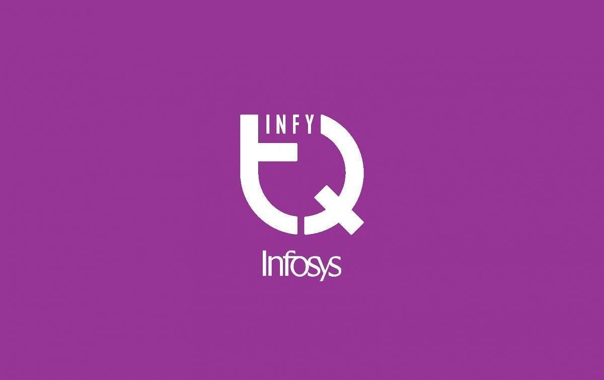

InfyTQ is a free platform open to all engineering students in their third and fourth year across India. The platform encourages holistic development by imparting technical as well as professional skills and help them become industry ready.

----

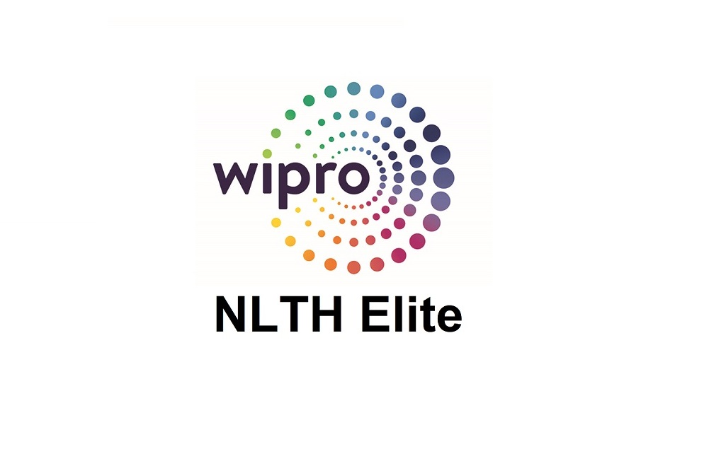

Image result for what is wipro nlth
Elite National Level Talent Hunt 2021 (NLTH) is a fresher's hiring initiative to attract the best of 2021 engineering talent across the country. And the objective of this initiative is to enable an equal opportunity for employment to the most deserving talent across all engineering streams in India.

----
